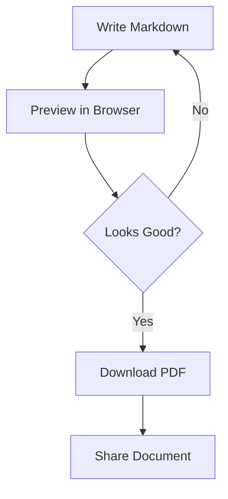
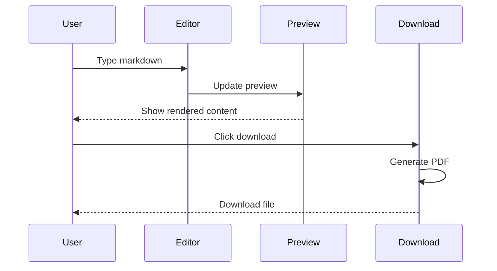

# Sample Document with Mermaid Diagrams

## Introduction

This is a simple example document to demonstrate the **Markdown to PDF** converter with Mermaid diagram support.

## Project Workflow

Here's a simple flowchart showing our development workflow:



## System Architecture


## Features Checklist

- [x] Real-time markdown preview
- [x] Mermaid diagram support
- [x] PDF download
- [x] Image embedding
- [x] Page breaks
- [x] Professional formatting

## Code Example

Here's a simple JavaScript function:

```javascript
function convertMarkdownToPDF(markdown) {
    const html = parseMarkdown(markdown);
    const pdf = generatePDF(html);
    return pdf;
}
```

## Data Table

| Feature | Status | Priority |
|---------|--------|----------|
| Mermaid Diagrams | ✅ Complete | High |
| Image Support | ✅ Complete | High |
| Page Breaks | ✅ Complete | Medium |
| Custom Styling | ✅ Complete | Low |

## User Journey



---

## Conclusion

This document demonstrates:

1. **Mermaid Diagrams** - Flowcharts and sequence diagrams
2. **Code Blocks** - Syntax highlighted code
3. **Tables** - Formatted data tables
4. **Page Breaks** - Using `---` separator
5. **Professional Layout** - Clean, readable format

**Try downloading this as a PDF to see all features in action!** 🎉
