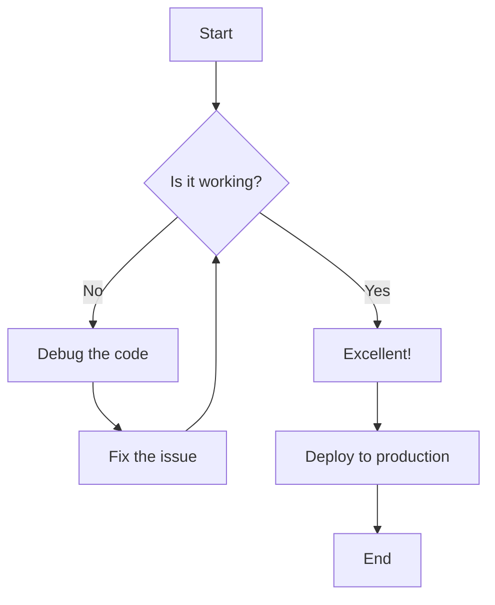
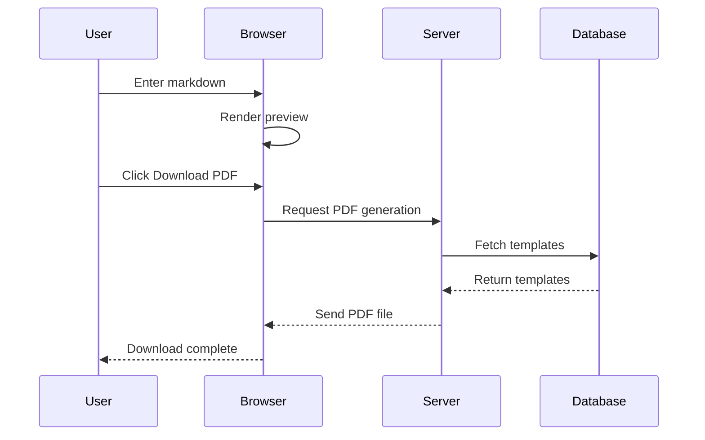
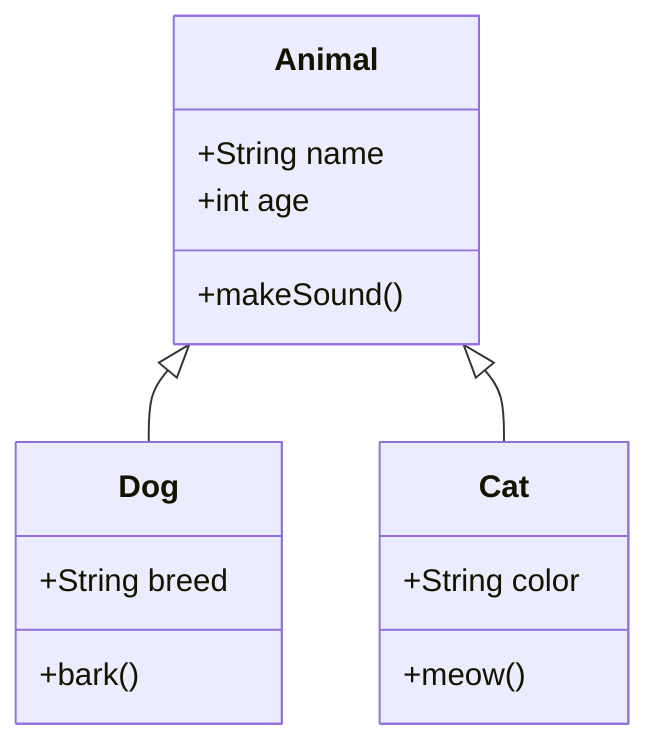

# Complete Markdown to PDF Test Document

## Table of Contents
1. [Introduction](#introduction)
2. [Text Formatting](#text-formatting)
3. [Code Examples](#code-examples)
4. [Mermaid Diagrams](#mermaid-diagrams)
5. [Tables](#tables)
6. [Images](#images)
7. [Conclusion](#conclusion)

---

## Introduction

This is a comprehensive test document to demonstrate the **Markdown to PDF** converter capabilities. It includes:

- ✅ Proper heading hierarchy
- ✅ Page breaks (using `---`)
- ✅ Mermaid flowcharts and diagrams
- ✅ Code blocks with syntax highlighting
- ✅ Tables with proper formatting
- ✅ Images (embedded)
- ✅ Internal links (Table of Contents)

> **Note**: This document showcases all major Markdown features and ensures they render correctly in the PDF output.

---

## Text Formatting

### Bold and Italic

You can use **bold text** for emphasis, *italic text* for subtle emphasis, and ***bold italic*** for maximum impact.

### Lists

**Unordered List:**
- First item
- Second item
  - Nested item 1
  - Nested item 2
- Third item

**Ordered List:**
1. First step
2. Second step
3. Third step

### Blockquotes

> "The best way to predict the future is to invent it."
> — Alan Kay

### Links

- External link: [Visit Google](https://google.com)
- Internal link: [Jump to Conclusion](#conclusion)

---

## Code Examples

### JavaScript Example

```javascript
// Function to calculate factorial
function factorial(n) {
    if (n === 0 || n === 1) {
        return 1;
    }
    return n * factorial(n - 1);
}

console.log(factorial(5)); // Output: 120
```

### Python Example

```python
# Class definition
class Person:
    def __init__(self, name, age):
        self.name = name
        self.age = age
    
    def greet(self):
        return f"Hello, my name is {self.name}"

# Create instance
person = Person("Alice", 30)
print(person.greet())
```

### Inline Code

Use `const variable = "value";` for inline code examples.

---

## Mermaid Diagrams

### Flowchart Example



### Sequence Diagram



### Class Diagram



---

## Tables

### Simple Table

| Feature | Status | Priority |
|---------|--------|----------|
| PDF Generation | ✅ Complete | High |
| Mermaid Support | ✅ Complete | High |
| Image Embedding | ✅ Complete | Medium |
| Page Breaks | ✅ Complete | Medium |
| Internal Links | ✅ Complete | Low |

### Complex Table

| Language | Typing | Paradigm | Use Case |
|----------|--------|----------|----------|
| JavaScript | Dynamic | Multi-paradigm | Web Development |
| Python | Dynamic | Multi-paradigm | Data Science, AI |
| Java | Static | Object-Oriented | Enterprise Apps |
| Rust | Static | Multi-paradigm | Systems Programming |
| Go | Static | Procedural | Cloud Services |

---

## Images

### Example Image Reference


*Note: Images are automatically embedded in the PDF with proper sizing and page break handling.*

---

## Conclusion

This document demonstrates the complete functionality of the **Markdown to PDF Converter**:

1. ✅ **Proper Formatting**: All headings, paragraphs, and text styles render correctly
2. ✅ **Code Blocks**: Syntax-highlighted code with proper formatting
3. ✅ **Mermaid Diagrams**: Flowcharts, sequence diagrams, and class diagrams converted to images
4. ✅ **Tables**: Complex tables with proper borders and alignment
5. ✅ **Images**: External images embedded directly in the PDF
6. ✅ **Page Breaks**: Horizontal rules (`---`) create page breaks
7. ✅ **Internal Links**: Table of contents links work within the document

### Next Steps

- Upload your own Markdown file
- Edit the content in the editor
- Click **Download PDF** to get your formatted document

**Thank you for using Markdown to PDF Converter!** 🎉

---

*Document generated with ❤️ by MarkdownPDF*
